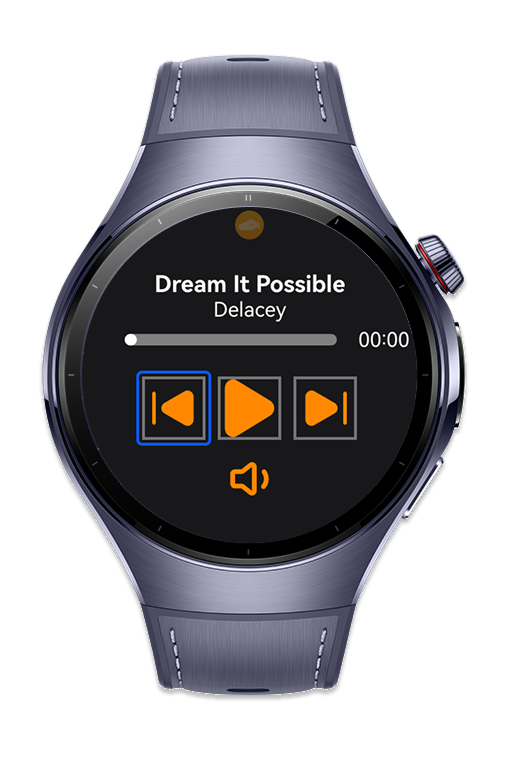
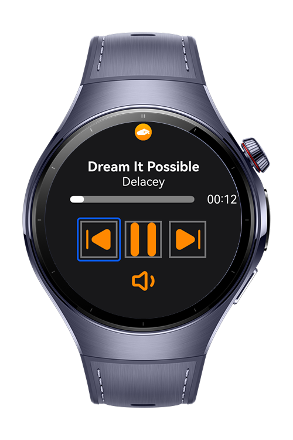
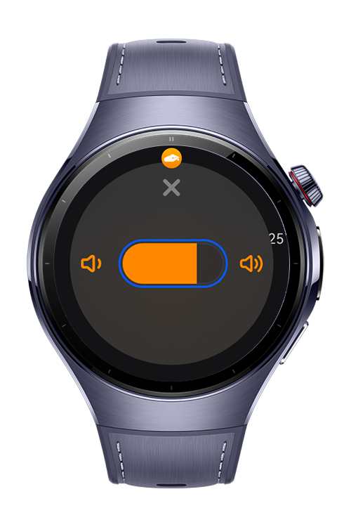

> **Note:** To access all shared projects, get information about environment setup, and view other guides, please visit [Explore-In-HMOS-Wearable Index](https://github.com/Explore-In-HMOS-Wearable/hmos-index).

# Music Player (Based Hand Gestures)

This app lets you control your music player using hand gestures.
You can navigate between buttons, play/pause, skip tracks, or adjust volume — all without touching the screen. Designed for hands-free, distraction-free control, this app aims to deliver a “one glance, one gesture” music experience. Whether you’re working out, cooking, or wearing gloves, this app brings intuitive gesture-based interaction to your everyday life.

# Preview

<div>
  
  
  
</div>

# Use Cases

- Workout / Running: Switch tracks or adjust volume without taking your phone out.

- Cooking / Busy hands: Control playback even when your hands are messy.

- Public transport / Glove mode: Keep control even when touch input doesn’t work well.

- Focus mode at desk: Manage music playback with subtle hand gestures.

- Accessibility: Provides an alternative control method for users with limited touch interaction

# Tech Stack

- **Languages**: ArkTS, ArkUI, TypeScript
- **Frameworks**: HarmonyOS SDK 5.1.0(18)
- **Tools**: DevEco Studio Version 5.1.1.823
- **Libraries**:
    - `@kit.ArkUI`
    - `@kit.ArkTS`
    - `@kit.AVSessionKit`
    - `@kit.AudioKit`
    - `@kit.MediaKit`
    - `@kit.ImageKit`
    - `@kit.BasicServicesKit`
    - `@kit.AbilityKit`
    - `@kit.PerformanceAnalysisKit`
    - `@kit.LocalizationKit`
    - `@kit.BackgroundTasksKit`


# Directory Structure

```
├───audio
│       AVSessionController.ets
│       BackgroundUtil.ets
│       CustomAudioManager.ets
│       MediaController.ets
│       MediaTools.ets
│
├───common
│   ├───constants
│   │       MusicData.ets
│   │
│   ├───model
│   │       MusicModel.ets
│   │
│   └───util
│           CustomDialogVolume.ets
│
├───entryability
│       EntryAbility.ets
│
├───entrybackupability
│       EntryBackupAbility.ets
│
├───pages
│       Index.ets
│       PlaybackPage.ets
│
└───viewmodel
        MainViewModel.ets

```

# Constraints and Restrictions

## Supported Device

* Huawei Watch 5

## Requirements
1. Configure signing settings.
2. Change module.json with your wearable app bundle name.
4. Change watch app bundle name with your bundle name.

# License

**Music Player** is distributed under the terms of the MIT License
See the [LICENSE](./LICENSE) for more information.